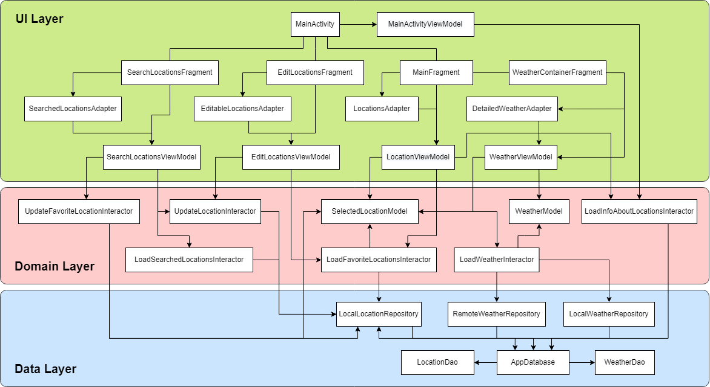

# Weather App

Приложение, предоставляющее сведения о прогнозе погоды.

## Author

Tyapukhin Vlad

## Mobile Test Task (Kotlin)

Написать приложение для погоды, имеющее следующий функционал:

1. При первом входе пользователь должен выбрать свой город.
2. На основном экране должна показываться детальная информация о погоде в городе.
3. Реализовать просмотр погоды на последующие дни (например, на предстоящую неделю).
4. Реализовать возможность добавлять дополнительные города.
5. Реализовать навигацию между экранами городов.

## Description

### API service

https://openweathermap.org

### Architecture

Приложение реализует архитектурный шаблон MVVM, используя Single-Activity с заменой фрагментов и имеет 3 слоя:

* UI layer - уровень пользовательского интерфейса, отображающий данные приложения на экране.
* Domain layer - доменный уровень, отвечающий за инкапсуляцию бизнес-логики, которая повторно используется несколькими моделями представления.
* Data layer - уровень данных, содержащий бизнес-логику приложения и предоставляющий данные приложения.

### Dependency Graph

## Recommendations

* Для успешной работы приложения при первом запуске необходимо дождаться завершения инициализации БД, не закрывая его. После успешной инициализации станет доступен основной функционал приложения.
* Проведите вниз по вертикали для получения актуального прогноза погоды. Необходимым условием является наличие подключения к интернету. В случае его отсутсвия будут загружены ранее кешированные данные при условии, что они есть. 
* Чтобы добавить свои любимые города, нажмите на знак плюса. В строке поиска рекомендуется использовать латиницу.
* Чтобы увидеть список избранных городов, нажмите на знак «Гамбургер».
* Проведите по горизонтали для просмотра прогноза погоды на неделю по дням.